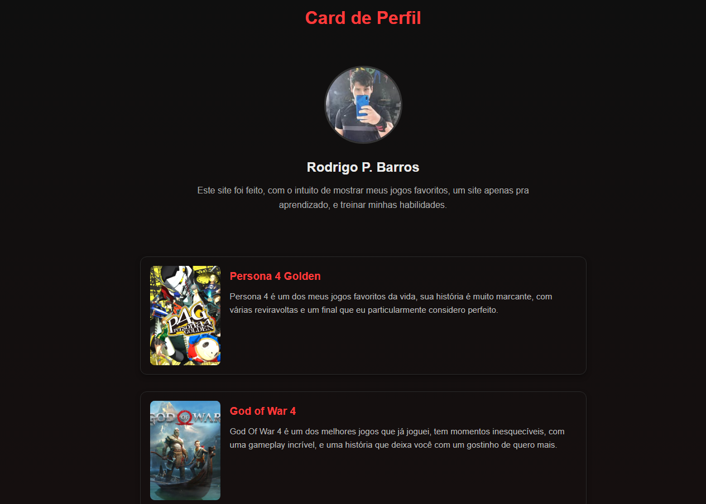

# 🎮 Perfil de Jogos

Projeto front-end simples desenvolvido com HTML e CSS, focado em prática de estruturação semântica e estilização de componentes.

O site apresenta um card de perfil com uma seleção de jogos favoritos, descrições e links sociais.

---

## 🚀 Tecnologias utilizadas

- HTML5
- CSS3

---

## 🎯 Objetivo do projeto

Este projeto foi criado com o objetivo de praticar:

- Estruturação semântica com HTML
- Organização de componentes visuais
- Estilização com CSS
- Uso de Flexbox
- Criação de layout centralizado e responsivo básico

---

## 🧱 Estrutura do projeto

perfil-jogos/
├── index.html
├── style.css
└── assets/
├── imagens dos jogos e perfil

---

## 💡 Funcionalidades

- Card de perfil com imagem e descrição
- Lista de jogos favoritos em formato de cards
- Botões de redes sociais
- Layout centralizado e estilizado com tema dark
- Efeitos de hover nos elementos

---

## 📱 Responsividade

O projeto possui ajustes básicos para adaptação em telas menores, mantendo a legibilidade e organização do conteúdo.

---

## 🧠 Aprendizados

Durante o desenvolvimento deste projeto, foram reforçados conceitos como:

- Estruturação de páginas web
- Uso de Flexbox para alinhamento
- Organização de código CSS
- Importância de consistência visual

---

## 📸 Preview

---

## 📌 Status

✔ Finalizado como projeto de estudo  
🚀 Em constante evolução com novos aprendizados

---

## 👨‍💻 Autor

Desenvolvido por Rodrigo Pinto Barros